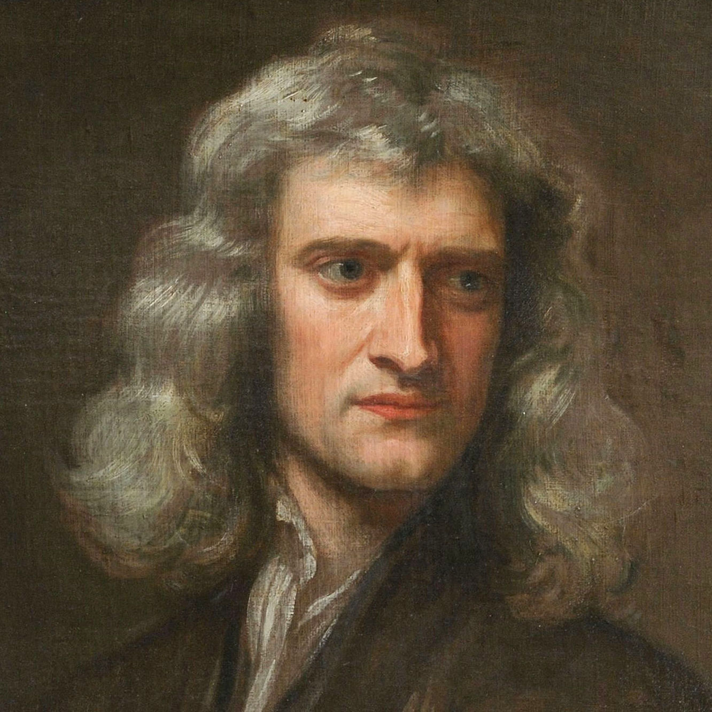
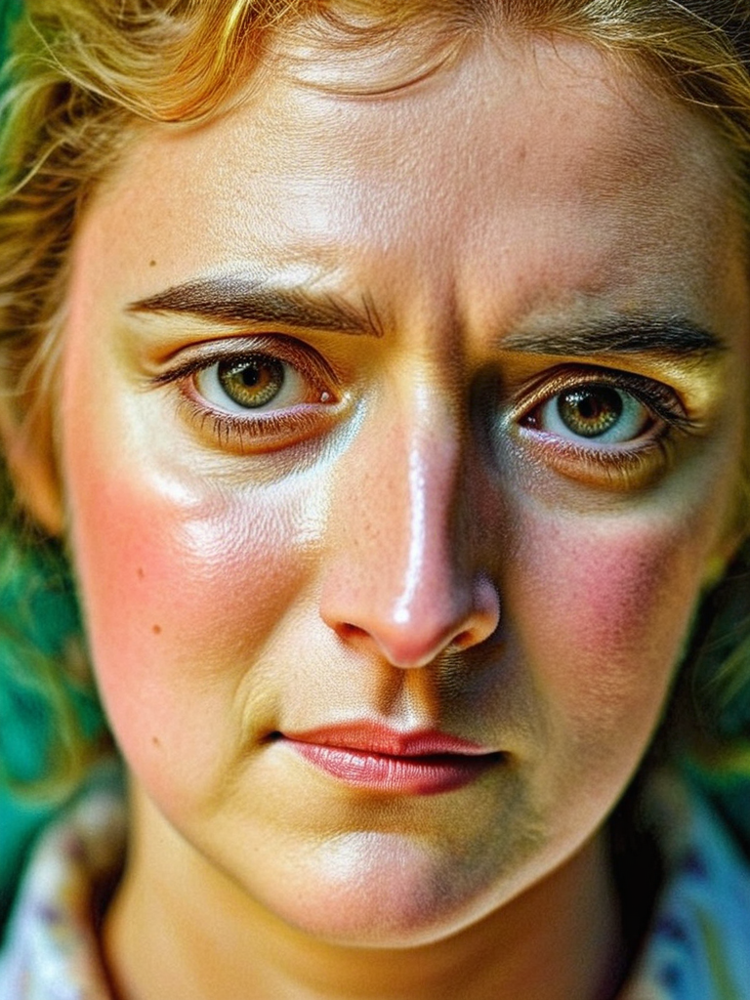

# Simple Photomaker - successor of PhotoMaker v2

This repository contains a simplified version of [PhotoMaker V2](https://github.com/TencentARC/PhotoMaker) that allows you to generate customized realistic human photos without using the Gradio UI. This guide will help you get started.

It includes simplified scripts for Ease Of Use. And Colab Customised compute code (T4 GPU).

## Setup Instructions

### 1. Clone the Repository

```bash
git clone https://github.com/jayeshthk/simple-photomaker
cd simple-photomaker
```

### 2. Install Dependencies

```bash
pip install -r requirements.txt
```

### 3. Prepare Your Images

Create a folder named `images` in the repository directory:

```bash
mkdir -p images
```

Add your face images to this folder. For best results:

- Use clear photos where the face occupies the majority of the image
- Use multiple images (1-5) of the same person for better ID fidelity
- Photos should have good lighting and clear facial features

## Usage

### Basic Usage

```python
from run import generate_image_no_gradio
import glob

image_paths = glob.glob("./images/*")

# OR custom List of image paths
# image_paths = ["images/face1.jpg", "images/face2.jpg"]

# Important: Always include the "img" trigger word after your subject
prompt = "a portrait photo of a woman img in a cyberpunk city, neon lights"

# Generate images
generated_images = generate_image_no_gradio(image_paths, prompt)

# Save the generated image
generated_images[0].save("output.png")
```

### Parameter Tuning Guide

The `generate_image_no_gradio` function accepts several parameters that you can tune:

```python
generate_image_no_gradio(
    image_paths,              # List of paths to face images
    prompt,                   # Text prompt (must include "img" after subject)
    negative_prompt="...",    # Things to avoid in generation
    aspect_ratio_name="",     # Aspect ratio preset (default is 1:1)
    style_name="...",         # Style template
    num_steps=50,             # More steps = higher quality but slower
    style_strength_ratio=20,  # Higher = stronger style influence
    guidance_scale=5.0,       # Higher = closer to prompt but less diversity
    seed=0,                   # Random seed for reproducibility
    use_doodle=False,         # Enable sketch-based control
    sketch_path=None,         # Path to sketch image if use_doodle=True
    adapter_conditioning_scale=0.7,  # Strength of adapter conditioning
    adapter_conditioning_factor=0.8  # Fraction of timesteps for adapter
)
```

### Parameter Descriptions

#### Essential Parameters

- **image_paths**: List of paths to your reference face images
- **prompt**: Your text prompt (must include the word "img" after the subject - like "man img" or "woman img")

#### Style Parameters

- **style_name**: Choose from available style templates:

  - "Photographic (Default)"
  - "Cinematic"
  - "Anime"
  - "Fantasy"
  - "Neon"
  - "Artistic"
  - "Vintage"
  - "Cyberpunk"
  - "Corporate"
  - "Professional"
  - "(No style)"

- **style_strength_ratio**: Controls how strongly the style is applied (15-50, default: 20)
  - Lower values preserve more ID fidelity
  - Higher values apply more style

#### Quality Parameters

- **num_steps**: Number of generation steps (20-100, default: 50)

  - Higher = better quality but slower

- **guidance_scale**: How closely to follow the prompt (0.1-10.0, default: 5.0)
  - Higher = closer to prompt but less creative
  - Lower = more creative but might diverge from prompt

#### Advanced Parameters

- **seed**: Set a specific seed for reproducible results (default: 0)

  - Use the same seed to generate consistent results

- **negative_prompt**: Things to avoid in the generated image

  - Default includes common issues like "low quality, bad anatomy" etc.

- **use_doodle**: Enable sketch-based control (default: False)

  - When True, use sketch_path to specify a sketch image

- **adapter_conditioning_scale**: Strength of sketch control (0.5-1.0, default: 0.7)
- **adapter_conditioning_factor**: Duration of sketch influence (0.5-1.0, default: 0.8)

## Examples

### Basic Portrait

```python
images = generate_image_no_gradio(
    ["images/face1.jpg"],
    "portrait photo of a woman img, colorful, perfect face, natural skin",
    style_name="Photographic (Default)"
)
```

### Cinematic Style

```python
images = generate_image_no_gradio(
    ["images/face1.jpg", "images/face2.jpg"],
    "closeup portrait of a man img in a suit, dramatic lighting",
    style_name="Cinematic",
    guidance_scale=7.0,
    style_strength_ratio=25
)
```

### Fantasy Character

```python
images = generate_image_no_gradio(
    ["images/face1.jpg"],
    "portrait of a woman img as an elf with pointy ears in a forest",
    style_name="Fantasy",
    num_steps=70
)
```

# Experiment

## Code

```python
images = generate_image_no_gradio(
    ["examples/newton_man/newton_0.jpg"],
    "instagram photo, portrait photo of a woman img, colorful, perfect face, natural skin, hard shadows, film grain",
    style_name="Fantasy",
    num_steps=70
)
```

## Result

<p align="center" style="display: flex; align-items: center; justify-content: center;">
  
  <span style="font-size: 10em; margin: 0 10px;">   =====>  </span>
  
</p>

## Troubleshooting

- **"Cannot find the trigger word 'img' in text prompt"**: Make sure your prompt includes "img" after the subject (e.g., "woman img" not just "woman")
- **"No face detected"**: Ensure your reference images have clear, prominent faces
- **Poor ID fidelity**: Try using more reference images or reducing style_strength_ratio
- **Out of memory**: Reduce num_steps or try a smaller aspect ratio

## Credits

This is a simplified version based on [PhotoMaker V2](https://github.com/TencentARC/PhotoMaker) by TencentARC. Please cite their work if you use this in your projects.
